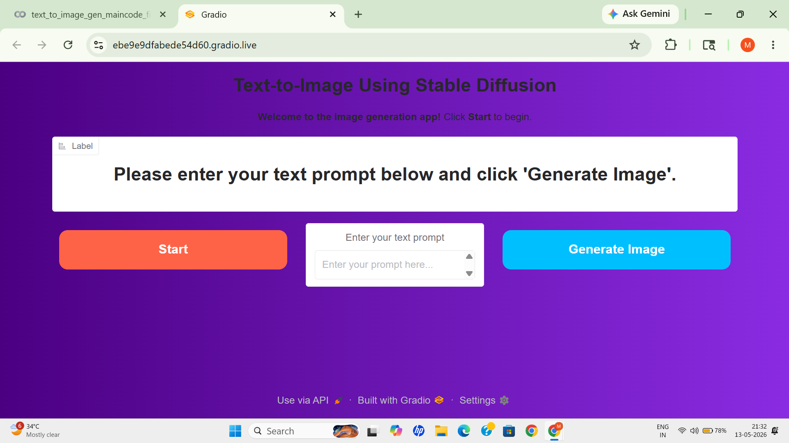
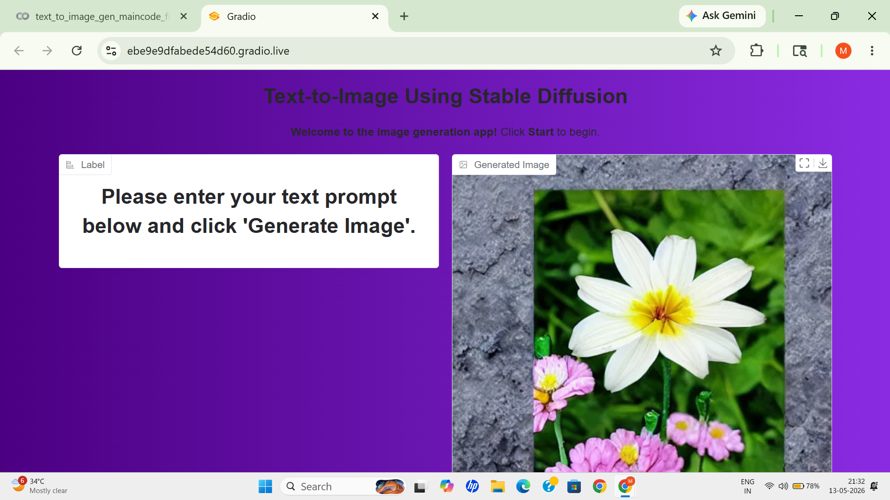

# Project Screenshots

## User Interface


## Generated Output


# AI-Based Text-to-Image Generation System


## Overview
This project is an AI-powered Text-to-Image Generation System developed using Stable Diffusion, Gradio, and Python. The application converts user-provided text prompts into AI-generated images using deep learning and generative AI techniques. It provides an interactive and user-friendly interface for generating creative visual outputs efficiently using GPU-supported environments like Google Colab.

## Features
- Generate images from text prompts
- Stable Diffusion-based image generation
- Interactive Gradio user interface
- GPU-supported execution using Google Colab
- Simple and user-friendly design

## Technologies Used
- Python
- Stable Diffusion
- Gradio
- PyTorch
- Hugging Face Diffusers
- Google Colab

## Project Structure

```text
AI-Based-Text-to-Image-Generation-System/
│
├── text_to_image_gen_maincode_fixed.ipynb
├── text-to-image-ui.png
├── text-to-image-demo.png
└── README.md
```

## Installation

### 1. Clone the repository

```bash
git clone https://github.com/YOUR-USERNAME/AI-Based-Text-to-Image-Generation-System.git
```

### 2. Navigate to the project folder

```bash
cd AI-Based-Text-to-Image-Generation-System
```

### 3. Install required dependencies

```bash
pip install torch torchvision diffusers transformers accelerate gradio pillow
```

## How to Run

### 1. Open the notebook in Google Colab

### 2. Enable GPU from Runtime settings

### 3. Run all notebook cells

### 4. Launch the Gradio interface

### 5. Enter a text prompt and generate images

## Dependencies
- PyTorch
- Stable Diffusion
- Diffusers
- Transformers
- Gradio
- Pillow

## Future Improvements
- Higher-resolution image generation
- More advanced AI models
- Download generated images
- Prompt enhancement system
- Multiple image style options
